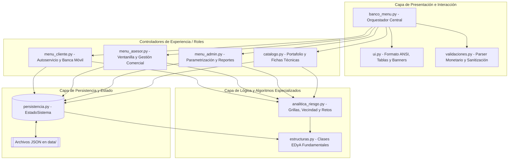

# 🏦 Sistema Bancario Digital — Plataforma Central Bancaria


Una plataforma bancaria digital integral desarrollada en **Python**, diseñada para simular las operaciones centrales (*Core Banking*) de una entidad financiera moderna. El sistema implementa **Estructuras de Datos y Algoritmos (EDyA / DSA)** construidos de forma nativa (listas doblemente enlazadas, colas FIFO, pilas LIFO con capacidad de deshacer operaciones, colas de prioridad basadas en montículos binarios, tablas hash con encadenamiento dinámico y matrices dispersas bidimensionales), acoplados a un motor de persistencia en archivos **JSON** y una interfaz interactiva de consola (**TUI**) con soporte ANSI enriquecido.

---

## 📋 Tabla de Contenidos

- [Visión General](#-visión-general)
- [Arquitectura del Sistema](#-arquitectura-del-sistema)
- [Estructuras de Datos Implementadas (DSA)](#-estructuras-de-datos-implementadas-dsa)
- [Analítica de Riesgo y Operaciones Matriciales](#-analítica-de-riesgo-y-operaciones-matriciales)
- [Roles y Funcionalidades del Sistema](#-roles-y-funcionalidades-del-sistema)
  - [1. Portal Público / Visitante](#1-portal-público--visitante)
  - [2. Banca Personas (Clientes)](#2-banca-personas-clientes)
  - [3. Consola de Operaciones (Asesor Comercial / Empleado)](#3-consola-de-operaciones-asesor-comercial--empleado)
  - [4. Panel de Administración Central (Administrador)](#4-panel-de-administración-central-administrador)
- [Validaciones Estrictas y Seguridad](#-validaciones-estrictas-y-seguridad)
- [Capa de Persistencia y Estructura de Datos JSON](#-capa-de-persistencia-y-estructura-de-datos-json)
- [Estructura del Repositorio](#-estructura-del-repositorio)
- [Credenciales de Prueba Preconfiguradas](#-credenciales-de-prueba-preconfiguradas)
- [Instalación y Guía de Uso](#-instalación-y-guía-de-uso)

---

## 🌟 Visión General

El **Sistema Bancario Digital** aborda de manera coordinada cuatro pilares de la ingeniería de software aplicada a las finanzas:

1. **Eficiencia Algorítmica:** Sustitución de listas e iteraciones ingenuas por estructuras de datos optimizadas con complejidades temporales objetivo $O(1)$ y $O(\log n)$.
2. **Modularidad y Separación de Responsabilidades:** Arquitectura desacoplada en capas: presentación visual (`ui.py`), sanitización y reglas de validación (`validaciones.py`), estructuras fundamentales (`estructuras.py`), analítica matricial (`analitica_riesgo.py`), persistencia en disco (`persistencia.py`) y controladores de rol (`menu_*.py`).
3. **Trazabilidad y Reversibilidad:** Registro de auditoría cronológico con capacidad de *Undo* (deshacer acciones operativas en ventanilla y reversión de modificaciones en clientes).
4. **Resiliencia y Persistencia Atómica:** Carga al iniciar el sistema y almacenamiento automático tras cada mutación de datos en archivos JSON independientes.

---

## 🏛 Arquitectura del Sistema



---

## 🧠 Estructuras de Datos Implementadas (DSA)

En el archivo [`estructuras.py`](estructuras.py) se implementan desde cero, sin bibliotecas de terceros para su estructura interna, las siguientes colecciones fundamentales:

| Estructura | Clase en Código | Aplicación en el Negocio Bancario | Complejidad Temporal Promedio |
| :--- | :--- | :--- | :---: |
| **Lista Doblemente Enlazada** | `ListaDoble` / `NodoDoble` | Gestión del portafolio comercial de productos y directorio secuencial de clientes. Soporta recorridos bidireccionales (`recorrer_adelante` / `recorrer_atras`). | Inserción: $O(1)$<br>Búsqueda: $O(n)$<br>Eliminación: $O(1)^*$ |
| **Cola FIFO** | `ColaFIFO` | Fila virtual de turnos de atención presencial en sucursal. Los clientes se atienden en estricto orden de llegada. Cuenta con soporte para reinsertar al frente (`encolar_frente`) en caso de reversión. | Encolar: $O(1)$<br>Desencolar: $O(1)$ |
| **Pila LIFO** | `PilaLIFO` / `AccionReversible` | Pila de auditoría del sistema y control de reversión (*Undo*). Permite registrar funciones *callback* reversoras y desapilar para revertir operaciones en caliente. | Apilar: $O(1)$<br>Desapilar: $O(1)$ |
| **Cola de Prioridad** | `ColaPrioridad` | Mesa de aprobación de créditos. Implementada mediante un **Min-Heap** (`heapq`). A menor *score* de riesgo crediticio, mayor prioridad de atención tiene la solicitud. Utiliza un contador interno para garantizar estabilidad ante empates temporales. | Inserción: $O(\log n)$<br>Extracción: $O(\log n)$ |
| **Tabla Hash** | `TablaHash` | Indexación de clientes por documento de identidad (cédula) y autenticación de usuarios por nombre de usuario (*alias*). Resuelve colisiones mediante encadenamiento (*chaining*) por *buckets* y ejecuta **Rehashing dinámico** al duplicar tamaño ($2k + 1$) cuando el factor de carga supera $0.75$. | Inserción: $O(1)$<br>Búsqueda: $O(1)$<br>Eliminación: $O(1)$ |
| **Matriz Dispersa 2D** | `Matriz` | Almacenamiento bidimensional indexado por coordenadas `(fila, columna)` o tuplas compuestas `(cliente::producto)`. Se emplea en la matriz de riesgo, matriz de tasas de interés por producto/plazo y acumulado transaccional. | Asignación: $O(1)$<br>Consulta: $O(1)$ |

*\* Eliminación en $O(1)$ conociendo el nodo, o $O(n)$ por predicado de búsqueda.*

---

## 📊 Analítica de Riesgo y Operaciones Matriciales

El módulo [`analitica_riesgo.py`](analitica_riesgo.py) implementa algoritmos analíticos avanzados sobre matrices bidimensionales:

### 1. Reto 1: Matriz Extendida de Riesgo $(n+1) \times (m+1)$
Toma la matriz dispersa de riesgo $M$ donde las filas corresponden a los clientes ($n$) y las columnas a los productos de crédito activos ($m$). Construye una grilla densa extendida calculando en tiempo lineal $O(n \times m)$:
- **Última columna por fila ($j = m$):** Promedio de riesgo individual del cliente a través de todas sus líneas evaluadas:
  $$\overline{R}_{cliente_i} = \frac{1}{m} \sum_{j=0}^{m-1} M[i][j]$$
- **Última fila por columna ($i = n$):** Promedio de riesgo sectorial del producto a través de todos los titulares:
  $$\overline{R}_{producto_j} = \frac{1}{n} \sum_{i=0}^{n-1} M[i][j]$$
- **Celda consolidada $[n][m]$:** Promedio general consolidado de la cartera de crédito del banco:
  $$\overline{R}_{global} = \frac{1}{n \cdot m} \sum_{i=0}^{n-1} \sum_{j=0}^{m-1} M[i][j]$$

### 2. Reto 2: Algoritmo de Vecindad Ortogonal y Detección de Zonas de Riesgo
Permite seleccionar una celda específica $(i, j)$ de la grilla original y evaluar sus vecinos inmediatos:
- **Arriba:** $(i-1, j)$
- **Abajo:** $(i+1, j)$
- **Izquierda:** $(i, j-1)$
- **Derecha:** $(i, j+1)$

**Propiedades del algoritmo:**
- **Control estricto de fronteras:** Si la celda se encuentra en una esquina o borde de la matriz, las posiciones fuera de rango se registran de forma segura como bordes nulos sin generar excepciones `IndexError`.
- **Diagnóstico de Zona de Alto Riesgo:** Se declara una alerta crítica si **todos los vecinos válidos** superan el umbral establecido (`UMBRAL_ALERTA_RIESGO = 50 pts`).
- **Detección del Vecino con Mayor Riesgo:** Identifica cuál de los cuadrantes ortogonales concentra el mayor indicador de exposición crediticia.

---

## 👥 Roles y Funcionalidades del Sistema

El sistema cuenta con un control de acceso basado en roles (RBAC):

```
                       ┌──────────────────────────────┐
                       │  Menú Principal del Sistema  │
                       └──────────────┬───────────────┘
            ┌─────────────────────────┼─────────────────────────┐
            ▼                         ▼                         ▼
   ┌─────────────────┐       ┌─────────────────┐       ┌─────────────────┐
   │  Banca Personas │       │ Asesor Comercial│       │  Administración │
   │   (Clientes)    │       │   (Ventanilla)  │       │     Central     │
   └─────────────────┘       └─────────────────┘       └─────────────────┘
```

### 1. Portal Público / Visitante
- **Consulta de Portafolio:** Exploración interactiva del catálogo de productos y tasas vigentes sin necesidad de registrarse.
- **Auto-registro Asistido:** Formulario de apertura de cuenta con validación de requisitos y depósito inicial opcional.
- **Acceso a Credenciales de Prueba:** Consulta rápida de los usuarios y claves configuradas para validación en entornos académicos y de laboratorio.

### 2. Banca Personas (Clientes)
- **Consulta de Perfil y Balance:** Visualización del estado de cuenta y productos bancarios suscritos.
- **Historial de Movimientos:** Consulta detallada de transacciones con identificador único (`TX-XXXX`), fecha, hora, tipo de movimiento, saldo resultante y detalle descriptivo.
- **Depósitos y Consignaciones:** Recepción de fondos en efectivo o transferencias con soporte para montos a gran escala (millones o billones de pesos) sin problemas de desbordamiento.
- **Retiro de Fondos:** Validación de saldo en tiempo real antes de debitar el dinero.
- **Transferencias Inmediatas:** Envío de fondos entre clientes registrados mediante débito/crédito sincronizado y generación de recibos digitales.
- **Solicitud de Créditos:** Radicación formal de líneas de crédito:
  - *Crédito Libre Inversión:* Desde \$500,000 COP, plazos de 6 a 60 meses.
  - *Crédito Hipotecario:* Mínimo reglamentario de \$10,000,000 COP y plazo mínimo de 60 meses (hasta 360 meses).
  - La solicitud se encola en el *Min-Heap* de evaluación de riesgo.
- **Simulador de Crédito:** Cálculo de cuotas fijas mensuales mediante la fórmula de anualidad y amortización francesa:
  $$\text{Cuota} = \text{Monto} \cdot \frac{i \cdot (1 + i)^n}{(1 + i)^n - 1}$$
- **Fila Virtual y Turnos:** Solicitud de turno de atención presencial, visualización de la posición en cola y cálculo del tiempo aproximado de espera.
- **Catálogo y Solicitud Directa:** Vinculación de nuevos productos activos a la cuenta.

### 3. Consola de Operaciones (Asesor Comercial / Empleado)
- **Monitoreo en Tiempo Real:** Dashboard con contadores en vivo de turnos en fila y solicitudes de crédito en cola de espera.
- **Gestión Integral de Clientes (CRUD):**
  - Registro de clientes con normalización automática de datos.
  - Búsqueda por documento en la `TablaHash` ($O(1)$).
  - Modificación de titulares con registro de reversión.
  - Eliminación en cascada sincronizada (remueve de la lista de clientes, tabla hash, usuarios y cola de turnos).
- **Atención de Turnos en Ventanilla:** Desencolado secuencial de clientes (`ColaFIFO`) y llamado a taquilla.
- **Comité de Crédito:**
  - Inspección ordenada de expedientes de crédito por prioridad de riesgo (Menor riesgo $\rightarrow$ Mayor prioridad).
  - Aprobación con desembolso automático de fondos en la cuenta del cliente y generación de transacción.
  - Rechazo definitivo o re-encolado.
- **Reversibilidad de Operaciones (Undo):** Capacidad de deshacer la última acción registrada en la `PilaLIFO` restaurando los datos a su estado previo.

### 4. Panel de Administración Central (Administrador)
- **Mantenimiento del Catálogo Maestro:** Creación de nuevos productos, activación/desactivación lógica, edición de especificaciones y eliminación.
- **Parametrización de Tasas de Interés:** Ajuste de tasas mensuales por producto y plazo dentro de la matriz de tasas.
- **Matrices Analíticas y Reportes Gerenciales:**
  - Acumulado de transacciones financieras por cliente.
  - Matriz de evaluación de riesgo crediticio.
  - Tablero de KPIs institucionales (clientes, usuarios, transacciones, turnos activos, solicitudes y eventos de auditoría).
  - **Reporte Bidimensional de Riesgo (Reto 1)** con promedios cruzados y promedio general del banco.
  - **Análisis de Vecindad y Zonas de Riesgo (Reto 2)** con diagnóstico de alertas.
- **Auditoría General del Sistema:** Consulta del historial completo de eventos diferenciando entre acciones operativas reversibles y registros informativos.
- **Control de Personal Interno:** Creación, consulta y revocación de permisos para cuentas de Asesores y Administradores.

---

## 🛡 Validaciones Estrictas y Seguridad

El módulo [`validaciones.py`](validaciones.py) implementa barreras de entrada para preservar la integridad de los datos:

| Campo | Regla de Validación | Tratamiento del Sistema |
| :--- | :--- | :--- |
| **Nombre Completo** | Mínimo dos palabras (nombre y apellido). Solo letras del alfabeto español (incluye tildes y ñ). Sin números ni caracteres especiales. | Se limpian espacios redundantes y se transforma automáticamente a **MAYÚSCULAS**. |
| **Número de Cédula** | Exclusivamente numérico, longitud entre **9 y 10 dígitos**. No admite duplicados en el sistema. | Limpieza de puntos y espacios; validación contra la `TablaHash` de clientes. |
| **Nombre de Usuario** | Mínimo **8 caracteres alfanuméricos**. Sin espacios, símbolos ni caracteres especiales. | Normalizado a minúsculas; validación de unicidad en la tabla de usuarios. |
| **Contraseña / PIN** | Mínimo 4 caracteres. | **Doble confirmación obligatoria** durante la captura. |
| **Montos Monetarios** | Acepta múltiples formatos: `50000000`, `50.000.000`, `$ 50,000,000.00`. | Algoritmo *parser* inteligente que discrimina separadores de miles y decimales, soportando montos hasta un billón de pesos sin pérdida de precisión. |
| **Crédito Hipotecario** | Monto mínimo: **\$10,000,000 COP**. Plazo mínimo: **60 meses** (5 años). | Verificación obligatoria en simulaciones y radicaciones. |

---

## 💾 Capa de Persistencia y Estructura de Datos JSON

Todos los datos se sincronizan en la carpeta [`data/`](data/) en formato JSON con codificación UTF-8 e indentación legible:

```
data/
├── usuarios.json             # Cuentas de acceso (alias, rol, credencial PIN, cédula asociada)
├── clientes.json             # Expedientes de clientes (cédula, nombre, saldo, productos vinculados)
├── transacciones.json        # Libro contable de movimientos bancarios (TX-XXXX, fechas, montos, saldos)
├── productos.json            # Catálogo maestro de productos y servicios financieros
├── solicitudes_credito.json  # Solicitudes radicadas pendientes de decisión en el comité
├── tasas.json                # Matriz parametrizada de tasas de interés por producto y plazo
└── riesgo.json               # Matriz con los puntajes de riesgo asignados a clientes por producto
```

**Mecanismo de Autocarga y Tolerancia a Fallos:** Si alguno de los archivos no existe al momento de iniciar el sistema, la clase `EstadoSistema` en [`persistencia.py`](persistencia.py) lo crea automáticamente a partir de datos iniciales maestros preconfigurados.

---

## 📁 Estructura del Repositorio

```text
Banca/
├── data/                      # Archivos de base de datos en formato JSON
│   ├── clientes.json
│   ├── productos.json
│   ├── riesgo.json
│   ├── solicitudes_credito.json
│   ├── tasas.json
│   ├── transacciones.json
│   └── usuarios.json
├── analitica_riesgo.py        # Retos 1 y 2: Matriz extendida y análisis de vecindad
├── banco_menu.py              # Punto de entrada principal y orquestador del sistema
├── catalogo.py                # Visualización interactiva y fichas técnicas de productos
├── estructuras.py             # Implementación de EDyA: ListaDoble, ColaFIFO, PilaLIFO, TablaHash, Heap, Matriz
├── menu_admin.py              # Módulo de administración central y reportes gerenciales
├── menu_asesor.py             # Módulo de atención al público, ventanilla y comité de crédito
├── menu_cliente.py            # Portal de banca digital personas (autoservicio transaccional)
├── persistencia.py            # Manejador de persistencia JSON y estado global del sistema
├── ui.py                      # Componentes visuales, tablas, cajas de diálogo y formateo ANSI
├── validaciones.py            # Sanitización de entradas, reglas de negocio y validación de tipos
└── README.md                  # Documentación técnica completa del proyecto
```

---

## 🔑 Credenciales de Prueba Preconfiguradas

El sistema incluye cuentas precargadas en `data/usuarios.json` listas para realizar pruebas inmediatas:

| Rol | Usuario | Contraseña / PIN | Nombre Titular | Cédula | Características de Prueba |
| :--- | :--- | :---: | :--- | :---: | :--- |

| **Empleado** | `empleado1` | `1234` | JORGE SALAS | `1000000004` | Funciones operativas de apoyo comercial. |
| **Cliente** | `valen` | `1234` | VALENTINA MORALES | `1000000003` | Cuenta activa con saldo (\$235,000,000 COP), tarjeta y movimientos registrados. |
| **Cliente** | `andrescastro01` | `5678` | ANDRES FELIPE CASTRO | `1098765432` | Cuenta activa con saldo (\$20,000,000 COP). |

*Nota: Cualquier cliente registrado desde el menú principal o por un asesor podrá iniciar sesión inmediatamente con el usuario y contraseña asignados.*

---

## 🚀 Instalación y Guía de Uso

### Requisitos Previos
- **Python 3.8 o superior** instalado en el sistema.
- Terminal con soporte para caracteres UTF-8 y secuencias de color ANSI (Windows Terminal, PowerShell, Bash, Zsh).

### Pasos de Ejecución

1. **Clonar o descargar el repositorio:**
   ```bash
   cd Banca
   ```

2. **Verificar la versión de Python:**
   ```bash
   python --version
   ```

3. **Ejecutar la aplicación bancaria:**
   ```bash
   python banco_menu.py
   ```

### Compatibilidad en Windows
El módulo [`ui.py`](ui.py) habilita de forma automática el procesamiento de secuencias de escape ANSI para la consola de Windows (`os.system("")`) y reconfigura los flujos de entrada y salida estándar en codificación `utf-8`, garantizando la visualización de tildes, caracteres especiales y bordes gráficos de caja.

---

## ✒️ Autoría y Propósito Académico

Proyecto desarrollado como aplicación práctica y demostrativa de:
- **Estructuras de Datos Lineales y No Lineales.**
- **Algoritmos de Exploración Matricial y Vecindad en 2D.**
- **Arquitectura de Software Limpia y Desacoplada.**
- **Manejo de Transaccionalidad y Persistencia Concurrente en Archivos de Texto Estructurado.**
